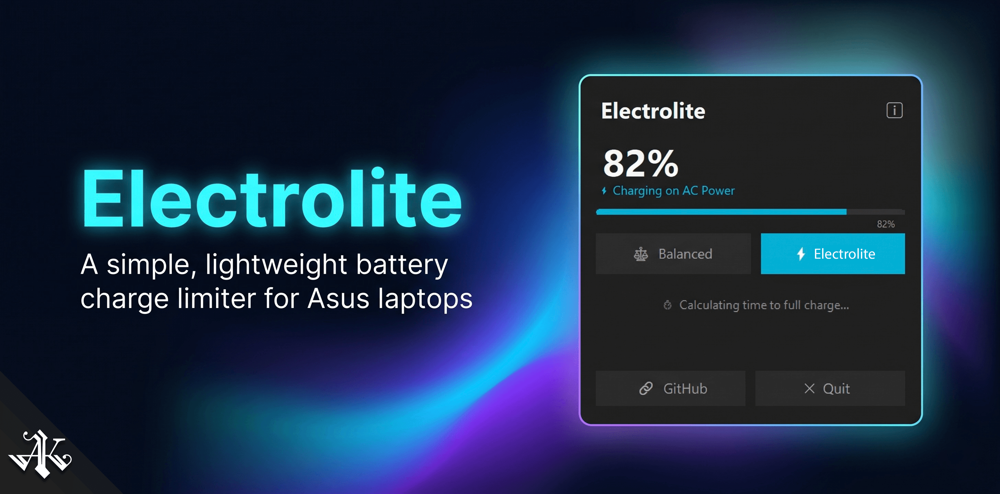
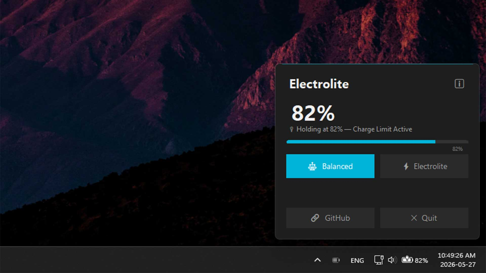
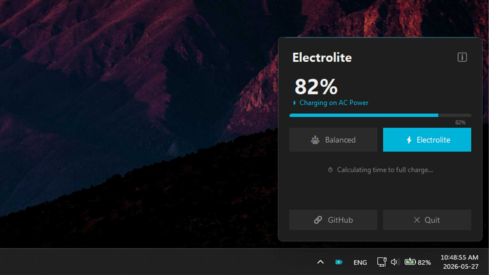

# ⚡ Electrolite

**A simple, lightweight Windows app for ASUS laptop owners to quickly top up their battery to 100% before leaving home.**

Electrolite sits silently in your system tray, letting you toggle your battery charge limit with a single click. It talks directly to your laptop's hardware to quickly remove the 80% limit so you can charge to full and head out.

---

## ⬇️ Quick Download

* **[Download Latest Lite Version](https://github.com/AliKarbasiCom/electrolite/releases/latest/download/Electrolite_lite.exe)** — *Requires [.NET 8 Desktop Runtime](https://dotnet.microsoft.com/download).*
* **[Download Latest Self-Contained Version](https://github.com/AliKarbasiCom/electrolite/releases/latest/download/Electrolite_self_contained.zip)** — *No dependencies required (pre-packaged runtime).*

---

## 🚀 Features

- **🔋 Balanced Mode (80%)** — Preserves battery health during stationary desk use.
- **⚡ Electrolite Mode (100%)** — Quickly charges to full capacity before you travel or leave home.
- **🪶 Zero Bloat** — Runs silently in the system tray with no taskbar presence.
- **📊 Real-Time Telemetry** — Instant UI updates when power source transitions (plug/unplug) using Windows kernel events and supplementary WMI queries.
- **🎹 Global Hotkey** — Press `Ctrl + Shift + B` to cycle modes instantly from anywhere.
- **🎨 Modern Aesthetics** — Sleek dark-mode glassmorphic flyout UI rendered directly above the taskbar with smooth slide-up height animation.

---

## 📸 App Modes

Electrolite has two operating modes to fit your daily usage pattern:

### ⚖️ Balanced Mode (80% Limit)
- **Purpose:** Keeps the battery healthy by capping the charge at 80%.
- **Use Case:** Best when your laptop is plugged in at your desk for extended periods. It prevents battery degradation caused by holding a high charge at constant high voltage.
- **Visuals:** Shows a gray tray icon and displays *"Holding at 80% — Charge Limit Active"* in the dashboard.



### ⚡ Electrolite Mode (100% Limit)
- **Purpose:** Removes all charging limits, allowing the battery to charge to its full 100% capacity.
- **Use Case:** Perfect for topping up your battery quickly right before you travel or leave home.
- **Visuals:** Shows a teal lightning bolt tray icon and displays *"Estimated time to full capacity"* or *"Limit removed"* in the dashboard.



---

## 📦 Download & Installation

1. Go to the [Releases](https://github.com/AliKarbasiCom/electrolite/releases) page.
2. Download the latest pre-compiled `Electrolite.zip` containing the standalone executable.
3. Extract and run `Electrolite.exe` as Administrator (required to communicate with the ASUS ACPI driver).
4. See the [Setup & Troubleshooting Guide](../docs/setup_guide.md) for instructions on running at Windows startup and resolving background service conflicts.

---

## 🛠️ Building & Exporting the Standalone `.exe`

To build the project yourself and produce a single-file, trimmed standalone executable:

### Prerequisites
- [.NET 8.0 SDK](https://dotnet.microsoft.com/download) installed.

### Publishing Command
Navigate to the root of the repository and run the following command in a terminal:

```bash
dotnet publish app/Electrolite.csproj -c Release -r win-x64 --self-contained false -p:PublishSingleFile=true
```

#### Parameter Breakdown:
- `-c Release`: Compiles with release optimizations.
- `-r win-x64`: Targets 64-bit Windows platforms.
- `--self-contained false`: Depends on the system's .NET 8 Desktop Runtime (keeps the binary extremely light, around ~1.2 MB). If you want it to run without any dependencies, change this to `--self-contained true` (creates a ~50 MB standalone executable).
- `-p:PublishSingleFile=true`: Packages all assemblies into a single standalone `.exe` file.

Once compiled, you will find the final executable `Electrolite.exe` in:
`app/bin/Release/net8.0-windows/win-x64/publish/`

---

## ⚙️ How It Works

Electrolite bypasses heavy manufacturer software suites and communicates directly with your laptop's hardware:

1. **Direct ACPI Driver Calls:** Writes the charge threshold (`80` or `100`) directly to the system's ASUS ACPI device driver (`\\.\ATKACPI` via `DeviceIoControl` with control code `0x0022240C` and method `DEVS` / device ID `0x00120057`).
2. **WMI Fallback:** If the direct driver path is not accessible, it falls back to calling the WMI method `DEVS` on `AsusAtkWmi_WMNB`.
3. **Registry Syncing:** Syncs the threshold value to the registry variant (e.g. `ChargingRate` under `SOFTWARE\ASUS\ASUS System Control Interface\AsusOptimization\ASUS Keyboard Hotkeys`) so that official ASUS services and the Windows settings interface remain aligned.
4. **Instant Telemetry:** Listens to `SystemEvents.PowerModeChanged` for real-time power source state tracking, combined with instant queries from `SystemInformation.PowerStatus` and battery status estimates from `Win32_Battery`.

---

## 💬 Feedback & Compatibility Testing

As ASUS has a wide variety of laptop models and hardware generations, your feedback is extremely valuable! 

If you test Electrolite, please let us know how it works on your machine:
* **GitHub Issues:** Open a quick ticket in the [Issues](https://github.com/AliKarbasiCom/electrolite/issues) tab to report your laptop model and testing success.
* **Direct Email:** You can also reach out directly via [feedback@alikarbasi.com](mailto:feedback@alikarbasi.com).

---

## 📜 License

Distributed under the **GNU General Public License Version 3 (GPL v3)**. See the [LICENSE](../LICENSE) file for the full legal text.
